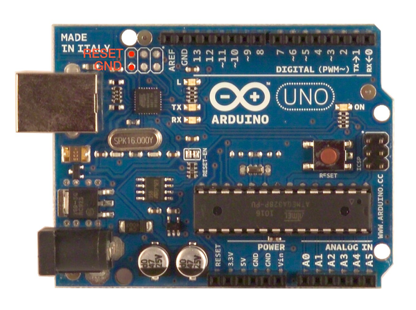

# Installer les dépendances de développement

Installer node.js puis:

```
sudo apt-get install libasound2-dev dfu-programmer
npm i
```

# Conf Xbee

```
+++
ATRE
ATID1
ATMY<1-9>
ATAP2
ATWR
ATCN
```

# Débugger

Utiliser les utilitaires `midiSend` et `midiSniffer` pour envoyer et recevoir des messages MIDI.

# Passer de mode Arduino à mode MIDI natif sur usb

Mettre en contact pendant 2 secondes les pins répérées en rouge ci-dessous:



Puis executer soit un `make mega` pour passer en mode arduino, ou un `make midi` pour passer en mode MIDI natif.

# Répartition des adresses MIDI

Voir la spec MIDI: [http://www.midi.org/techspecs/midimessages.php#2](http://www.midi.org/techspecs/midimessages.php)

## Luminosité des LEDS des planètes

Envoyer un Control Change sur le channel 12. Utiliser le bit de controle afin d'identifier la planète et le bit de value pour controler la luminosité.

Exemple: Mettre la luminosité de la planète 1 à fond.

```
./midiSend -p 1 -m 187,9,127
```
- Selon la spec le control change du channel 12 est repéré par le nombre 187.
- Les leds de la planète n°X sont gérées par le controller X-8 (ici 9 est donc le controller des leds de la planète 1).
- La valeur de luminosité va de 0 (éteinte) à 127 (allumée à fond).

## Led de status de l'install

Channel 13, controller 18, value 0 (éteinte) ou 1 (allumée).

Exemple: Allumer puis éteindre la led de status
```
./midiSend -p 1 -m 188,18,1
./midiSend -p 1 -m 188,18,0
```

## Boutons du boitier

- Bouton vert: play possible quand led allumée, envoie un Control Change sur le channel 1, controller 19 avec une value 1.

- Bouton rouge: reset de l'install, à tout moment, envoie un Control Change sur le channel 1, controller 20 avec une value 1.

## Planètes

Toutes les 100ms, des Control Change sont envoyés sur le channel 11. La valeur varie de 0 (planète sur son socle) à 127 (planète au max de la hauteur de captation du capteur). Un Control Change n'est envoyé que si la hauteur de la planète a changée.

Chaque planète dispose d'un numéro de controller sur ce channel 11. Voici comment ils sont attribués:

|Planète|Controller|
|---|---|
|1|1|
|2|2|
|3|3|
|4|4|
|5|5|
|6|6|
|7|7|
|8|8|
